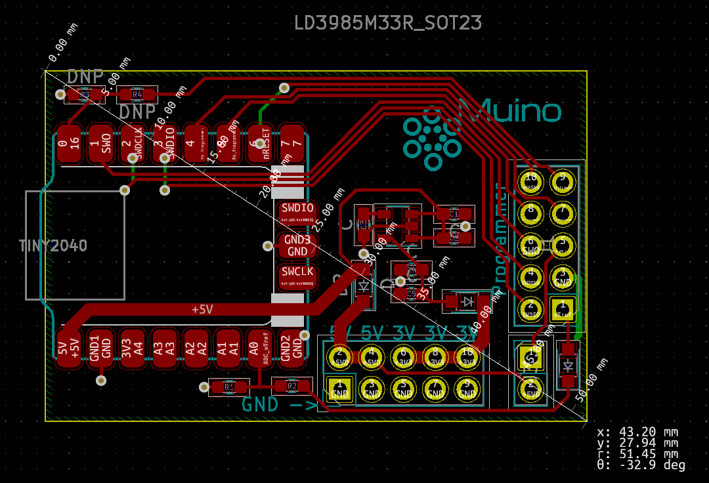

# pico-probe-programmer
The pico can be used to program other devices. Raspberry pi made such an effort. However there is no board yet, that is open-source and can be used with openocd as a general purpose programmer.


# A quick order ordering
Take a PCB maker like JLCPCB. Use the all the files from the `pcb-readyto-order/`, the Bom fils is not needed for that, but there is a list of the different type of components. The complete list needs to be updated soon. When I finally understand the BOM generation of Kicad. See tempory list below under *Design choice* chapter.


# What software is needed?
The software found in the submodules. I also added the pico-sdk to it, for code compatibility.
``` bash
cd pico-probe-programmer/
git submodule update --init 
```

Then go to the folder `pico-probe`, run the commands:
```bash
mkdir build/
cd build/
cmake ..

```

This will generate `picoprobe.uf2`. Or use the prebuild file: `binaries/picoprobe.uf2`. I prebuild this file, so I can quickly update it to a programmer if I need it again.


# Design choice
I like to use the [Pogo style adapter](https://www.tag-connect.com/info). For work and hobby projects it saves a head to solder, and the PCB looks more cleaner. Sometimes I need a 3V3 power pin or 5V power pin so I added an extra header for it. If you are not interested in the 3V3 or want to save componentens? The schema part 3V3 supply does not need to be added to the pcb. Actually, the PIM558 and the programmer header are madetory.
For custom program headers I added the possiblity to add 5V to pin 5 of the programmer header to disable power to the board that needs to be programmed. For my own custom boards I use the 5V to directLy power purposes.


List of values, soon to be added to the schematics
* C1: 1UF
* C2: 100nF
* C3: 10nF
* C4: 4.7uF
* C5: 100nF
* R1: 10K
* R2: 100
* d1,2,3: BAT60JFILM
* 2.54mm male headers 02x05
* A1: PIM558 - Tiny 2040
* U1: LD3985M33R

In the future I want to add some extra features like read voltage of target and detection of GND. Though making it a pull-up (internally in the 2040), and read the voltage on the pin. The voltage read is what Segger-Jlinks do to detect voltage issues on target board.

# Layout




# Hardware licence 
The hardware is licensed under [CERN-OHL-S v2](https://cern.ch/cern-ohl).

[
