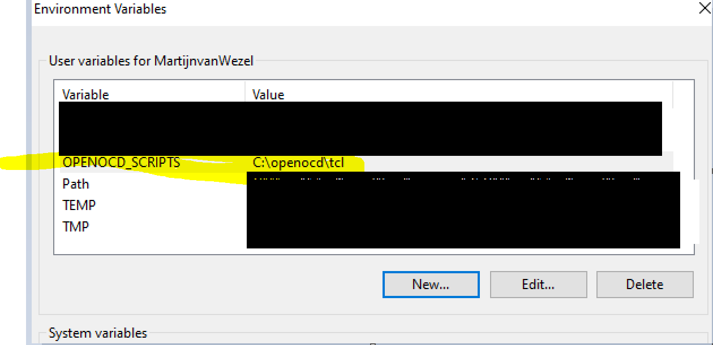
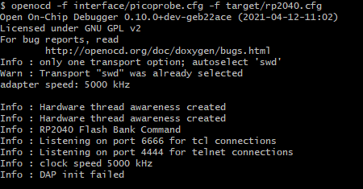

# Windows install - example with RPi Pico

## Step 1
Download the [Zadig USB tool](https://zadig.akeo.ie/) and select the Picoprobe and libusb-win32.


## Step 2
Follow the tutorial [digikey-tutorial](https://www.digikey.nl/en/maker/projects/raspberry-pi-pico-and-rp2040-cc-part-2-debugging-with-vs-code/470abc7efb07432b82c95f6f67f184c0) you can download the OpenOCD toolchain, that is already being build. I can add this to this repo if people need that. This however, only works in Git Bash or MinGW environments.

## Step 3 
Add the paths to the system, you should restart `git-bash` always fully, so all windows should be closed, or just reboot just to be sure. The following are the paths:  




* `OPENOCD_SCRIPTS` -> with value `c:\openocd\tcl` 
* `Path` -> add the following `C:\openocd\src`
A without the env solution, you can use the `-s` option:
``` bash
openocd -f interface/picoprobe.cfg -f target/rp2040.cfg -s /c/openocd/tcl/
``` 

Add the following files into the same directory (`src`) as the `openocd.exe`, where the location is:
* `tcl/interface/picoprobe.cfg` 
* `tcl/target/rp2040.cfg` 

## Step 4
Validate if everythings works fine
``` bash
openocd -f interface/picoprobe.cfg -f target/rp2040.cfg
``` 


The DAP init failed means that it didn't correctly connect with the device that you want to connect to. Check the cables or connections to the pins.

## Step 5
Happy programming/debugging.


